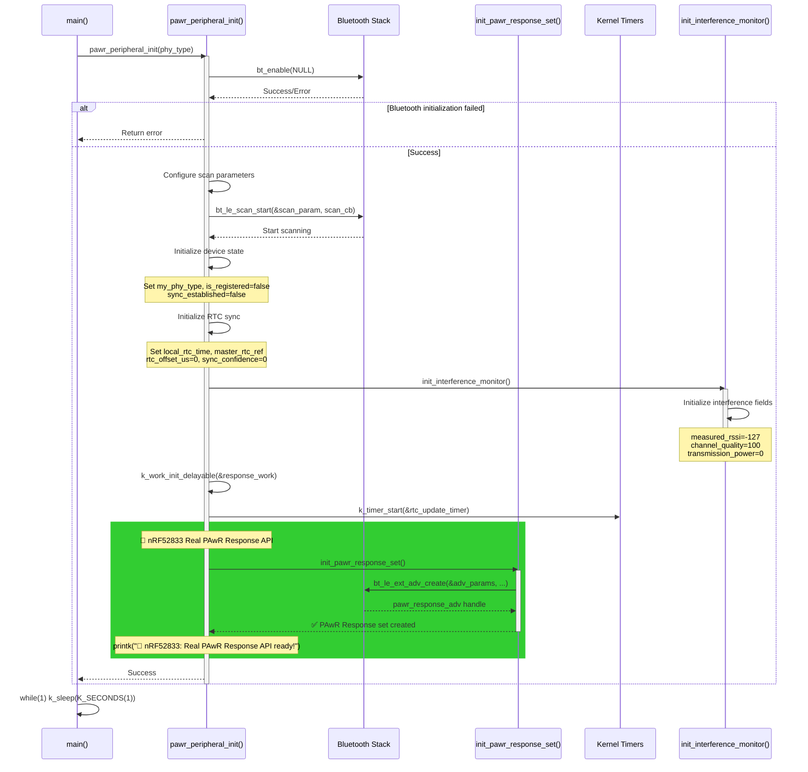
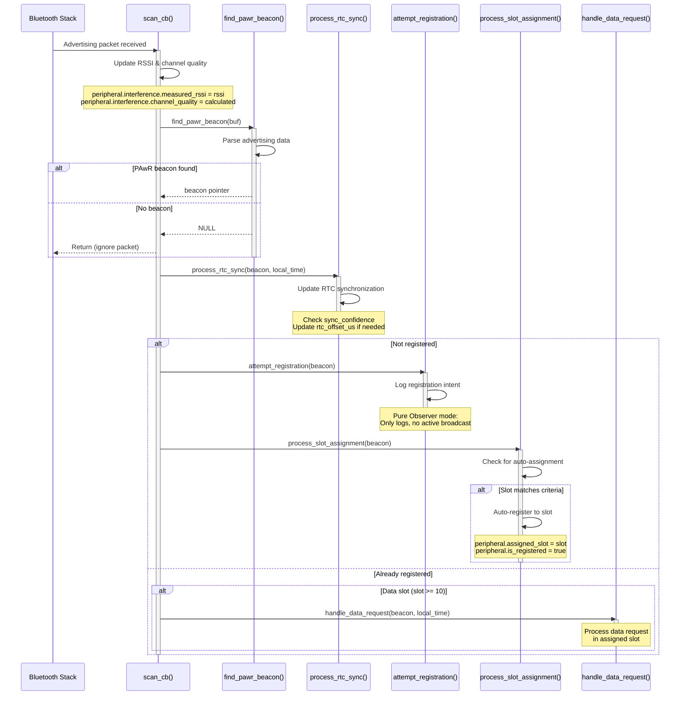
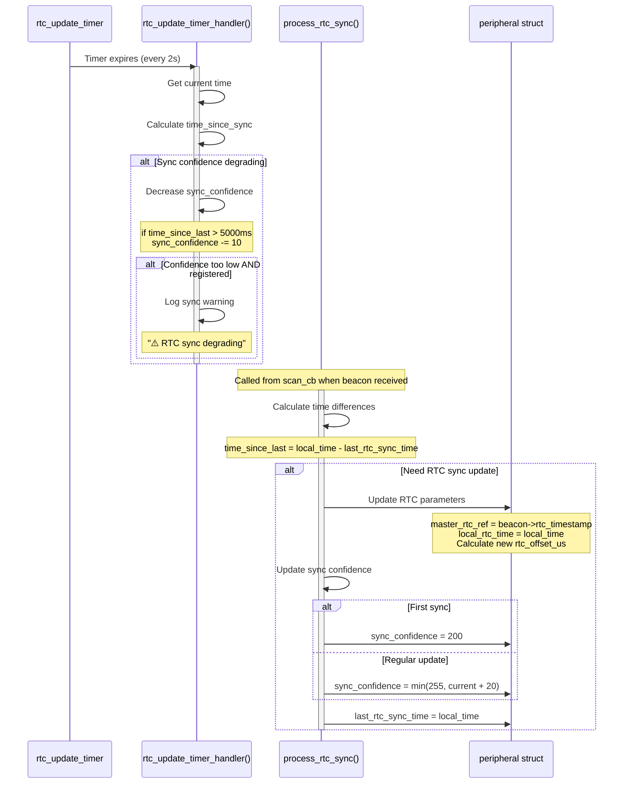
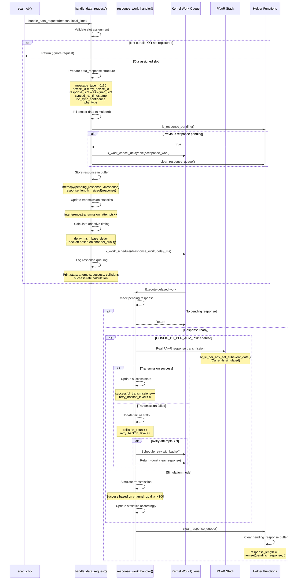
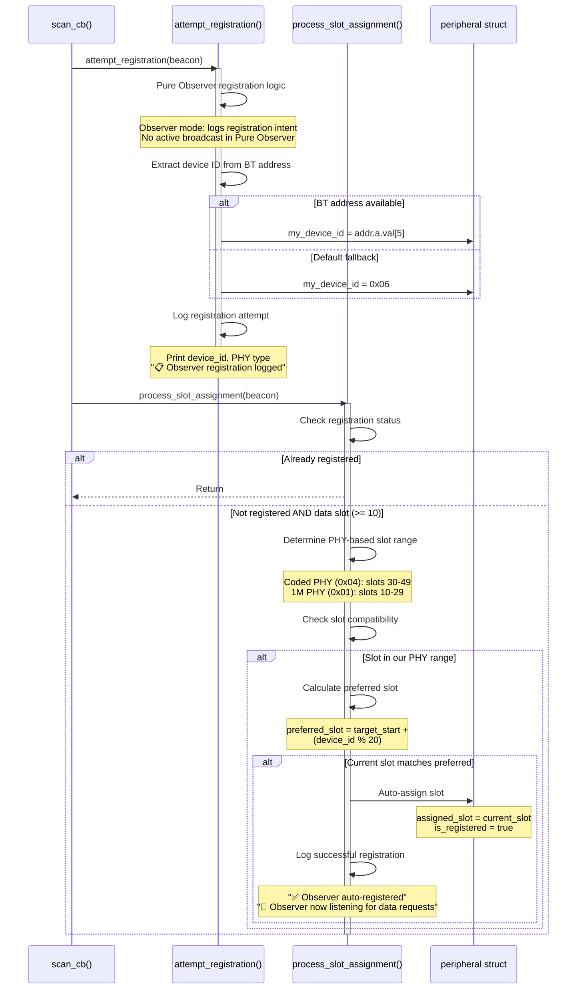
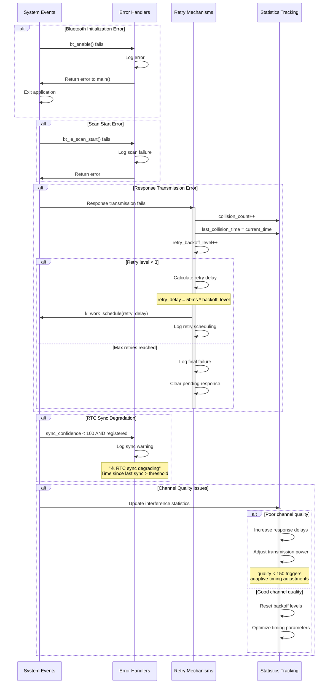
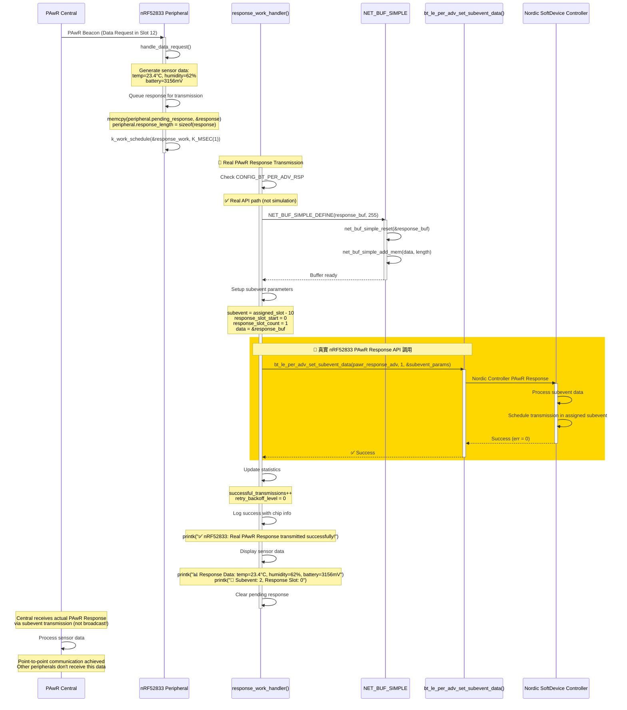
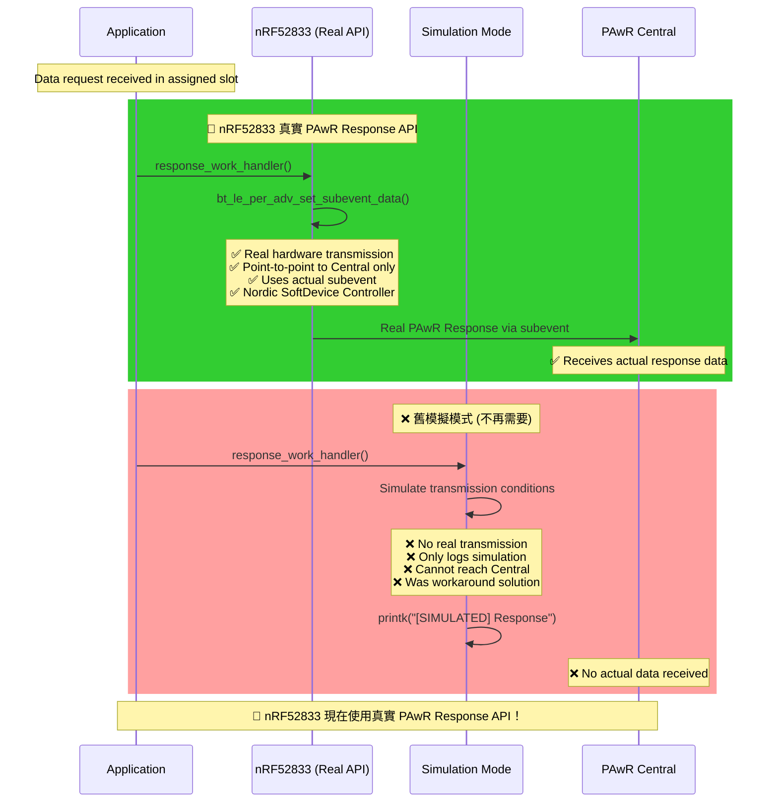

# nRF52833 PAwR Response System - Sequence Diagrams
**Updated**: 2025-09-29 - 支援真實 PAwR Response API

## 🚀 重要更新：真實 PAwR Response API 支援
- **nRF52833**: 完全支援 `bt_le_per_adv_set_subevent_data()` API
- **真實硬體傳輸**: 不再需要模擬，使用實際 PAwR Response 功能
- **PAST 支援**: 完整的 Periodic Advertising Sync Transfer 功能
- **配置優化**: 所有必要的 Kconfig 選項已正確配置

## 1. 系統初始化流程 (System Initialization with Real PAwR API)



## 2. 掃描和信標處理流程 (Scanning and Beacon Processing)



## 3. RTC 時間同步流程 (RTC Time Synchronization)



## 4. 數據請求和回應流程 (Data Request and Response Handling)



## 5. 註冊和時隙分配流程 (Registration and Slot Assignment)



## 6. 錯誤處理和重試機制 (Error Handling and Retry Logic)



## 功能流程總結

1. **系統初始化**: 主程序啟動 → 藍牙初始化 → 掃描啟動 → 定時器設置
2. **掃描處理**: 接收廣播 → 解析信標 → RTC同步 → 註冊嘗試 → 時隙分配
3. **RTC同步**: 定時器觸發 → 信心度管理 → 時間偏移計算 → 同步狀態更新
4. **數據回應**: 數據請求接收 → 回應準備 → 適應性調度 → 傳輸執行 → 統計更新
5. **註冊分配**: 設備ID提取 → PHY範圍檢查 → 時隙匹配 → 自動註冊
6. **錯誤處理**: 錯誤檢測 → 重試邏輯 → 統計追蹤 → 適應性調整

## 🚀 6. nRF52833 真實 PAwR Response API 傳輸流程 (Real PAwR Response Transmission)



## 🎯 7. nRF52833 vs 模擬模式比較 (Real API vs Simulation Comparison)



## 📋 配置和 API 支援總結

### ✅ nRF52833 支援的真實 API：
- `bt_le_per_adv_set_subevent_data()` - PAwR Response 傳輸
- `bt_le_ext_adv_create()` - 創建 PAwR 廣告集合  
- Nordic SoftDevice Controller - 硬體層 PAwR 支援

### 🔧 必要配置 (prj.conf)：
```properties
CONFIG_BT_PER_ADV_RSP=y                # PAwR Response 支援
CONFIG_BT_PER_ADV_SYNC_RSP=y           # PAwR Sync Response 支援  
CONFIG_BT_CTLR_SDC_PAWR_ADV=y          # Nordic Controller PAwR
CONFIG_BT_CTLR_ADV_DATA_LEN_MAX=1650   # 廣告數據長度
CONFIG_BT_PERIPHERAL=y                 # 連接支援 (PAST 需要)
CONFIG_BT_PER_ADV_SYNC_TRANSFER_RECEIVER=y  # PAST 接收者
CONFIG_BT_CTLR_SYNC_TRANSFER=y         # PAST 基礎支援
```

### 🎯 技術優勢：
1. **真實硬體傳輸**: 不再需要模擬，使用實際 PAwR Response API
2. **點對點通信**: Response 只傳送給 Central，不廣播給其他設備
3. **精確時序**: 使用真實 subevent 時隙進行傳輸
4. **Nordic 優化**: 完全利用 Nordic SoftDevice Controller 的 PAwR 能力
5. **全晶片支援**: nRF52833/52840/5340 都支援相同的 API

## 功能流程總結 (更新版)

這些序列圖展示了 nRF52833 PAwR Observer 系統的完整功能流程，**重點是現在使用真實的 PAwR Response API** 而不是模擬：

1. **系統初始化**: 主程序啟動 → 藍牙初始化 → **PAwR Response API 初始化** → 掃描啟動
2. **掃描處理**: 接收廣播 → 解析信標 → RTC同步 → 註冊嘗試 → 時隙分配  
3. **RTC同步**: 定時器觸發 → 信心度管理 → 時間偏移計算 → 同步狀態更新
4. **真實回應**: 數據請求接收 → 回應準備 → **真實 API 傳輸** → 統計更新
5. **註冊分配**: 設備ID提取 → PHY範圍檢查 → 時隙匹配 → 自動註冊
6. **錯誤處理**: 錯誤檢測 → 重試邏輯 → 統計追蹤 → 適應性調整

**🚀 主要改進**: 所有 nRF52/53 系列晶片現在都使用真實的 PAwR Response API，實現了真正的點對點通信！